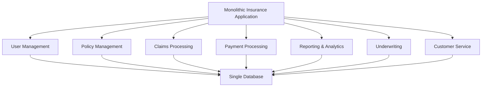
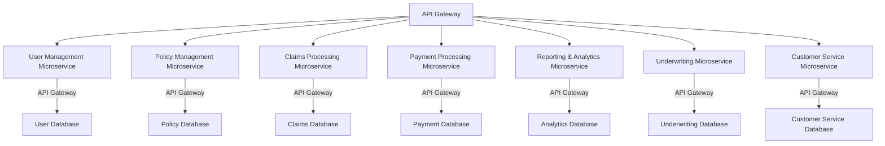

# **Case Study: Implementing Microservices in the Insurance Domain**

## **Overview**

In this case study, we will explore how an insurance company can transition from a monolithic architecture to a microservices-based architecture. This transition will address scalability, agility, and resilience challenges faced by the company. We will use diagrams to illustrate the key aspects of this transformation.

---

## **Background**

**Company:** ABC Insurance  
**Industry:** Insurance  
**Current Architecture:** Monolithic  
**Challenges:**
- Difficulty in scaling specific components.
- Long release cycles due to tightly coupled systems.
- High impact of failures in one part of the system on the entire application.
- Difficulty in adopting new technologies due to the monolithic nature of the system.

---

## **Monolithic Architecture**

### **Diagram: Current Monolithic System**

## **Challenges with the Monolithic Architecture**

1. **Scalability Issues:**
   - The entire application must be scaled even if only one component (e.g., Claims Processing) experiences high load.

2. **Tightly Coupled Systems:**
   - Changes in one module require testing and redeploying the entire application, leading to long release cycles.

3. **Single Point of Failure:**
   - A failure in any module (e.g., Payment Processing) can bring down the entire application.

4. **Inflexibility:**
   - Difficulty in adopting new technologies or modernizing specific components without affecting the entire system.

---

## **Transition to Microservices**

**Objective:** Decouple the monolithic architecture into microservices to address scalability, agility, and fault tolerance.

---

## **Microservices Architecture**

### **Diagram: Proposed Microservices Architecture**

## **Key Components of the Microservices Architecture**

1. **API Gateway:**
   - Centralized entry point for all client requests.
   - Handles request routing, composition, and protocol translation.

2. **Independent Microservices:**
   - **User Management Microservice:** Manages user profiles and authentication.
   - **Policy Management Microservice:** Handles policy creation, updates, and renewals.
   - **Claims Processing Microservice:** Processes insurance claims, validation, and status tracking.
   - **Payment Processing Microservice:** Manages premium payments, billing, and refunds.
   - **Reporting & Analytics Microservice:** Provides insights, reports, and analytics on policies and claims.
   - **Underwriting Microservice:** Assesses risk and determines policy terms and pricing.
   - **Customer Service Microservice:** Handles customer inquiries, complaints, and support.

3. **Decentralized Databases:**
   - Each microservice has its own dedicated database, ensuring data autonomy and reducing the risk of bottlenecks.

## **Benefits of Microservices Architecture**

1. **Scalability:**
   - Each microservice can be scaled independently based on demand, e.g., scaling the Claims Processing service during peak times.

2. **Improved Agility:**
   - Development teams can work on different services simultaneously, speeding up the release cycles.

3. **Fault Isolation:**
   - Failure in one service (e.g., Payment Processing) does not affect the operation of other services.

4. **Technology Flexibility:**
   - Different services can be developed using different technologies suited to their specific needs, allowing for modernization without impacting the entire system.

5. **Resilience:**
   - Implementing retry mechanisms, circuit breakers, and failovers within each service improves overall system resilience.

---

## **Implementation Steps**

1. **Identify Core Services:**
   - Break down the monolithic application into core business functions that can be implemented as microservices.

2. **Establish API Gateway:**
   - Implement an API Gateway to manage traffic and act as a single entry point for all client requests.

3. **Decouple Databases:**
   - Migrate to decentralized databases, ensuring each microservice has its own data store.

4. **Implement CI/CD Pipelines:**
   - Set up continuous integration and deployment pipelines for each microservice to enable independent and faster releases.

5. **Monitor and Optimize:**
   - Implement logging, monitoring, and alerting systems for each service to ensure performance and reliability.

---

## **Conclusion**

By transitioning from a monolithic to a microservices architecture, ABC Insurance can achieve greater scalability, agility, and fault tolerance. This architectural change will enable the company to respond more effectively to market demands, deploy new features faster, and ensure a more resilient and reliable service for its customers.

This case study illustrates the practical benefits of adopting microservices in a domain like insurance, where complex processes and high transaction volumes demand a flexible and scalable approach to software architecture.
