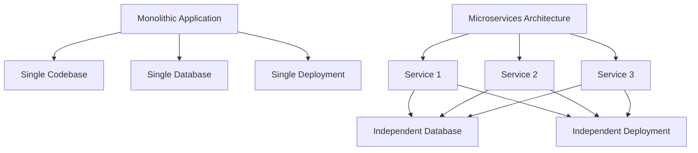
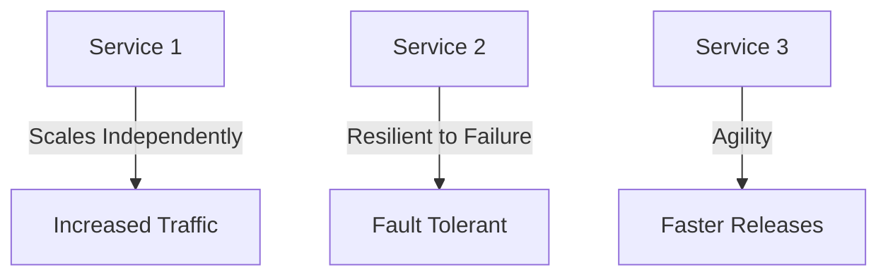
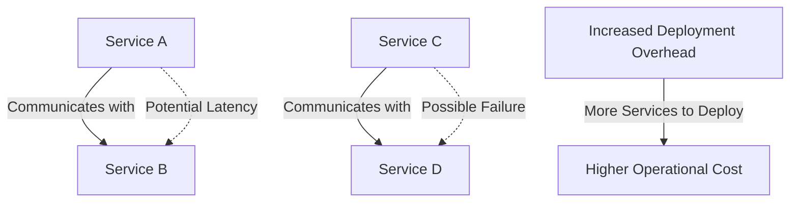
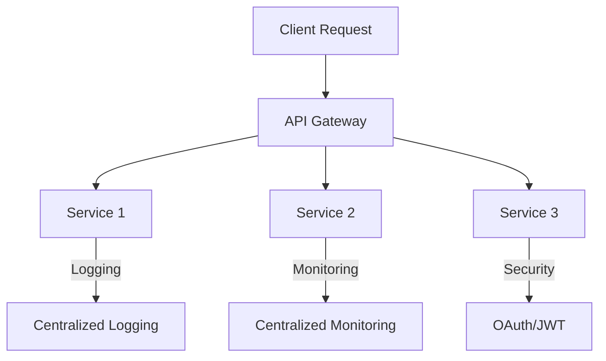
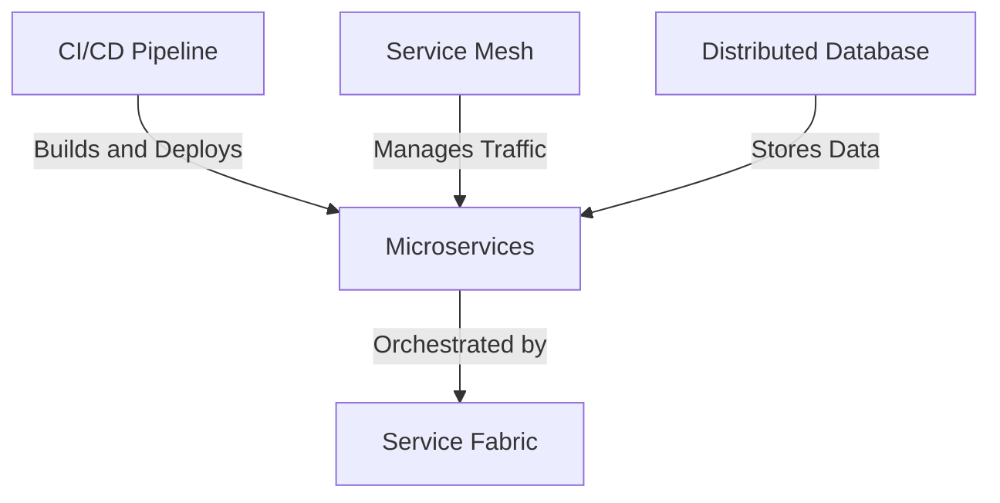
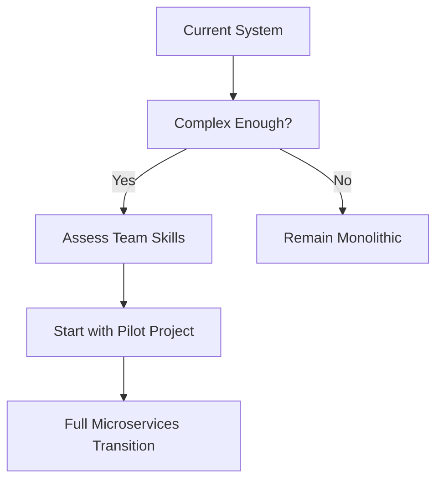

# **Understanding Microservices**

## **Introduction to Microservices**

### **Key Points:**
- Brief overview of what microservices are.
- Contrast with monolithic architecture.
- Microservices break down a large application into smaller, manageable services.

---

## **Key Characteristics of Microservices**

### **Key Points:**
- **Independent Deployability:** Each service can be deployed independently.
- **Decentralized Data Management:** Each microservice has its own database or storage.
- **Technology Agnostic:** Allows the use of different technologies for different services.
- **Scalability:** Each service can be scaled independently based on demand.
- **Fault Isolation:** Failure in one service does not bring down the entire system.

---

## **Advantages of Microservices**

### **Key Points:**
- **Scalability:** Ability to scale individual services independently.
- **Resilience:** High availability and fault tolerance due to isolated services.
- **Agility:** Faster development cycles due to independent services.
- **Resource Optimization:** Scale only the services that need more resources, reducing costs.
- **Continuous Delivery:** Easier to implement CI/CD pipelines, allowing for rapid deployments.

---

## **Disadvantages and Challenges of Microservices**

### **Key Points:**
- **Complexity:** Increased complexity in managing and orchestrating multiple services.
- **Data Consistency:** Maintaining data consistency across services can be challenging.
- **Deployment Overhead:** Managing deployments for multiple services increases operational overhead.
- **Inter-service Communication:** Latency and failure handling in service-to-service communication.
- **Security Concerns:** Need for secure communication between services, which can be complex.
- **Cost:** Potential increase in infrastructure costs due to the need for more resources.

---

## **Best Practices for Implementing Microservices**

### **Key Points:**
- **Design for Failure:** Implement retries, circuit breakers, and fallbacks.
- **API Gateway:** Use an API gateway to handle cross-cutting concerns.
- **Containerization and Orchestration:**
  - **Service Fabric:** Use Microsoft Service Fabric for orchestrating microservices with deep integration into the .NET ecosystem.
- **Service Discovery:** Implement service discovery mechanisms for dynamic service management.
- **Logging & Monitoring:** Use centralized logging and monitoring solutions.
- **Security:** Implement OAuth, JWT, and secure communication (TLS) between services.

---

## **Tools & Technologies**

### **Key Points:**
- **Service Fabric:** For orchestrating and managing microservices, particularly within the .NET ecosystem.
- **CI/CD Pipelines:** Tools like Jenkins, GitLab CI, or GitHub Actions for continuous integration and delivery.
- **Service Mesh:** Solutions like Istio or Linkerd for managing microservices communications.
- **Distributed Databases:** Databases like Cassandra or MongoDB for handling distributed data.

---

## **Case Studies or Success Stories**

### **Key Points:**
- Overview of companies that have successfully implemented microservices.
- Highlight the outcomes like improved scalability, faster time-to-market, and enhanced reliability.

---

## **Considerations Before Moving to Microservices**

### **Key Points:**
- **Assessment of Current Architecture:** Is your current system complex enough to require microservices?
- **Organizational Readiness:** Evaluate team skills and the readiness to manage microservices.
- **Incremental Transition:** Start with a pilot project or migrate a single service before moving entirely to microservices.
- **Cost-Benefit Analysis:** Ensure that the benefits outweigh the potential increase in complexity and cost.

